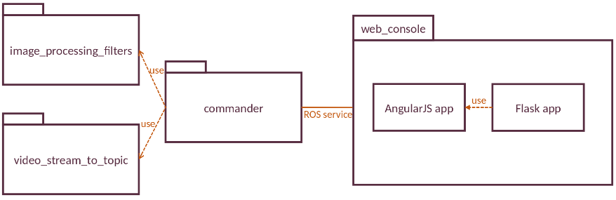

# ROS Cameras Controller

## Overview
ROS Cameras Controller uses streamed videos and helps to manage them. 

[](https://www.youtube.com/watch?v=Fejp80YfLMQ)

The project consists of these [ROS] packages (more details in readme files of each package):
* [commander](commander) - handles requests made by other packages.
* [image_processing_filters](image_processing_filters) - allows to apply image processing filter to ROS image topics.
* [video_stream_to_topic](video_stream_to_topic) - converts video stream (e.g. from IP camera) and converts it to ROS image topic.
* [web_console](web_console) - runs web consoles for managing cameras. It uses Flask for app back-end and AngularJS for front-end.

## Architecture


## Development

### Dependencies
- [Robot Operating System (ROS)] (Middleware for Robotics).
- [OpenCV] (Computer Vision).
- [Flask] (Back-End App).
- [AngularJS] (Front-End App).
- [npm] (Front-End Package Manager).

### Building (simple)

To build, clone the latest version from this repository into your catkin workspace and compile the package using:
```bash
cd catkin_workspace/src
git clone https://github.com/ugnelis/ros_cameras_controller.git
cd ../
catkin_make
```

### Building (detailed)
1. Install [*Ubuntu 16.04 LTS*](http://releases.ubuntu.com/16.04/), [*ROS Kinetic*](http://wiki.ros.org/kinetic/Installation) and [*OpenCV 3.1+*](https://docs.opencv.org/3.1.0/d7/d9f/tutorial_linux_install.html).

2. Make sure that [ROS] environment is setup: [link](http://wiki.ros.org/kinetic/Installation/Ubuntu#kinetic.2BAC8-Installation.2BAC8-DebEnvironment.Environment_setup).

3. Install *web_video_server*:
```bash
sudo apt-get install ros-kinetic-web-video-server
```

4. Install *rosbridge-suite*:
```bash
sudo apt-get install ros-kinetic-rosbridge-suite
```

5. Install *NodeJS* and *npm*:
```bash
curl -sL https://deb.nodesource.com/setup_8.x | sudo -E bash -
sudo apt-get install -y nodejs
```

6. Install *Flask*:
```bash
sudo pip install Flask
```

7. Create catkin workspace for storing ROS source projects:
```bash
mkdir -p ~/catkin_ws/src
cd ~/catkin_ws/
catkin_make
```

8. Source catkin workspace:
```bash
source ~/catkin_ws/devel/setup.bash
```

(Recommended) It's convenient if catkin workspace environment variables are automatically added to your bash session every time a new shell is launched: 
```bash
echo "source ~/catkin_ws/devel/setup.bash >> ~/.bashrc
source ~/.bashrc
```

9. Clone this project to `~/catkin_ws/src`:
```bash
cd ~/catkin_ws/src
git clone https://github.com/ugnelis/ros_cameras_controller.git
cd ../
catkin_make
```

10. (First build only) If `ros_cameras_controller` packages aren't found, reopen terminal or source catkin workspace again:
```bash
source ~/catkin_ws/devel/setup.bash
```

### Running (production)
1. Start the **commander** package:
```bash
roslaunch commander commander.launch
```

2. Start the **web_console** package:
```bash
roslaunch web_console web_console.launch
```

3. **web_console** is now running on http://localhost:9999.

### Running (development)
1. Open first terminal and run **commander** package:
```bash
roslaunch commander commander.launch
```

2. Open second terminal and run **rosbridge_server** package:
```bash
roslaunch rosbridge_server rosbridge_websocket.launch
```

3. Open third terminal and run **web_video_server** package:
```bash
rosrun web_video_server web_video_server _port:=8888
```

```bash
roscd web_console/src/front_end_app
npm start
```

## Testing
The [web_console](web_console) package has been tested under [ROS] Kinetic and Ubuntu 16.04.

## License
The source code is released under the [BSD 3-Clause license](LICENSE).

**Author: Ugnius Malūkas**

**Maintainer: Ugnius Malūkas, ugnius@malukas.lt**

[Robot Operating System (ROS)]: http://www.ros.org
[OpenCV]: https://opencv.org
[Flask]: http://flask.pocoo.org
[npm]: https://www.npmjs.com
[AngularJS]: https://angularjs.org
[ROS]: http://www.ros.org/
