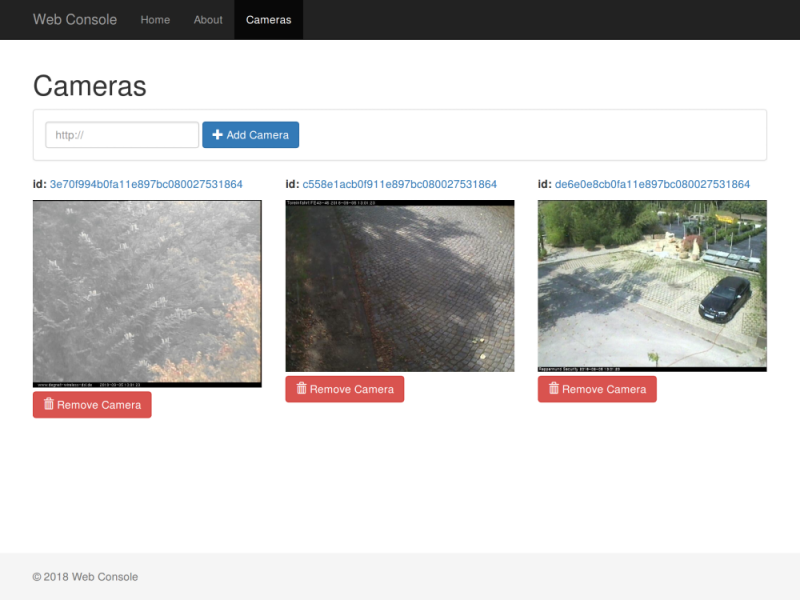

# web_console

## Screenshot

## Overview

This is package which runs web consoles for managing cameras. It uses Flask for app back-end and AngularJS for front-end.

**Keywords:** web console, camera, Flask, AngularJS.

### License

The source code is released under a [BSD 3-Clause license](LICENSE).

**Author(s): Ugnius Malūkas  
Maintainer: Ugnius Malūkas, ugnius@malukas.lt**

The web_console package has been tested under [ROS] Kinetic and Ubuntu 16.04.

## Installation

### Building from Source

#### Dependencies

- [Robot Operating System (ROS)] (Middleware for Robotics),
- [Flask] (Back-End App),
- [AngularJS] (Front-End App),
- [npm] (Front-End Package Manager)

#### Building

To build from source, clone the latest version from this repository into your catkin workspace and compile the package using

	cd catkin_workspace/src
	git clone https://github.com/ugnelis/ros_cameras_controller.git
	cd ../
	catkin_make

## Usage

Run the main node with

	roslaunch web_console web_console.launch

## Launch files

* **web_console.launch:** *web_console*, *web_video_server* nodes and `rosbridge_websocket.launch` are launched.
    
    Arguments

    - **`port`** *web_video_server* port. Default: `8080`.

## Nodes

### web_console

Converts video stream and makes it as a ROS image topic.

## Bugs & Feature Requests

Please report bugs and request features using the [Issue Tracker](https://github.com/ugnelis/ros-cameras-controller/issues).

[Robot Operating System (ROS)]: http://www.ros.org
[Flask]: http://flask.pocoo.org
[npm]: https://www.npmjs.com
[AngularJS]: https://angularjs.org
